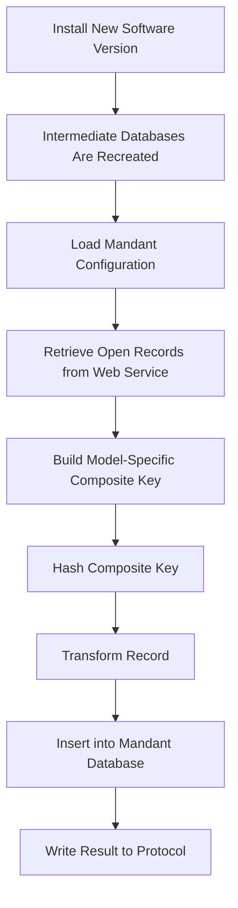
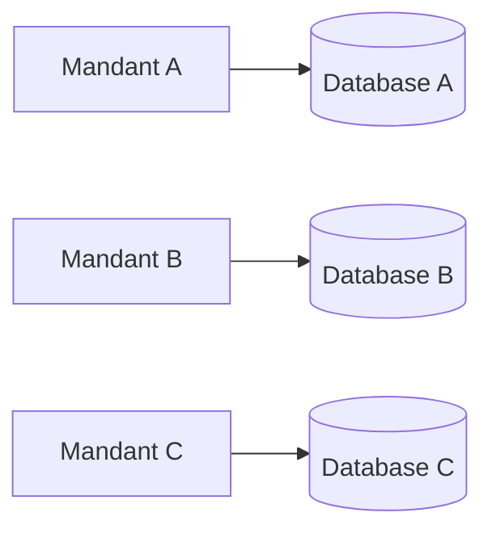

# Open Data Recovery Tool

A Tcl-based internal tool for restoring open business records after installing a new software version at a customer site.

## Overview

During a software installation, the existing intermediate databases were removed and recreated.

Open business records were still available through the company’s internal Web Service, but restoring them manually was time-consuming and error-prone.

This tool automates the recovery process by retrieving open records, generating hashed business keys, transforming the data, and inserting each record into the correct Mandant-specific database.

## Workflow



## Features

* Retrieves open records from the internal Web Service
* Supports multiple Mandants and business data models
* Writes each Mandant’s data to its dedicated database
* Generates deterministic composite keys
* Hashes keys before database insertion
* Logs successful operations and processing errors
* Continues with other Mandants when one Mandant fails
* Reduces manual work during software installations

## Supported Data Models

Examples of supported business records include:

* Goods Receipt
* Order Confirmation

Each model has its own key-generation strategy.

A Goods Receipt key may contain:

```text
Document Number + Position Number
```

An Order Confirmation key may contain:

```text
Document Number + Position Number + Confirmation Type
```

The confirmation type is required because different confirmation records may belong to the same document and position.

## Key Generation


The identifying fields are selected according to the data model. The resulting composite key is then hashed and used as the database identifier.

## Mandant Processing

Each Mandant is assigned to a specific data model and a dedicated intermediate database.



Mandants are processed independently. An error in one Mandant is logged without stopping the remaining Mandants.

## Error Handling and Logging

The application records information such as:

* Application start and end
* Current Mandant
* Number of retrieved records
* Number of inserted records
* Web Service errors
* Database errors
* Unexpected failures

Fatal errors are handled at the application entry point, while Mandant-specific errors are handled inside the Mandant processing boundary.

## Authentication

The tool does not implement application-level authentication.

It runs inside the company environment on systems that are already authorized to access the internal Web Service.

## Requirements

* Tcl
* Access to the internal Web Service
* Access to the Mandant-specific databases
* Required Tcl packages
* Permission to write the protocol file

## Usage

```bash
tclsh main.tcl
```

After execution, review the generated protocol and verify the restored records in the corresponding intermediate databases.

## Benefits

* Faster customer software installations
* Less manual data entry
* Lower risk of incorrect or missing records
* Consistent key generation
* Isolated processing for each Mandant
* Easier troubleshooting through protocol logs

## Internal Project Notice

This project was developed for internal company use. Internal endpoints, customer data, database credentials, and confidential configuration values are not included.
